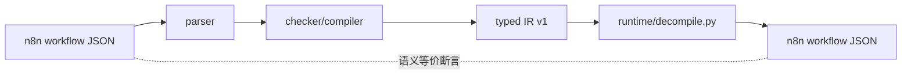

# 反编译 round-trip：IR -> n8n JSON 闭环（2026-08-18）

A 方向里程碑：编译前端已与 n8n JSON 侧闭环。`runtime/decompile.py` 把
typed IR v1 还原为 n8n 可导入的工作流 JSON，验证「编译无损」，为部署
adapter（IR 部署回 n8n）和真实执行验证打基础。

## 闭环



回归固化在 `tests/test_decompile.py`：节点集合（type/typeVersion/position/
parameters）与连接集合（from/port_index/to/index）双重等价断言；合成
`__exit__` 不在产物中；篡改/损坏 IR 显式拒绝。

## 归一化决策（n8n 原生形状对齐）

| 差异 | 处理 |
|---|---|
| `typeVersion` int vs float | IR 内部统一 float（`type_version: float`）；反编译时整值浮点归一为 int |
| `position` int vs float | 同上，`[0.0, 0.0]` -> `[0, 0]` |
| `parameters` 缺省 vs `{}` | n8n 导出恒含 parameters 键（空也 `{}`），反编译恒写入 |
| JSON 数值类型 | JSON 不分 int/float，测试归一化比较（int/float position、`or {}`）防御漂移 |

原则：**反编译输出对齐 n8n 原生导出形状**（对拍基准见
`n8n-runtime-chain.md` §5），语义往返由测试断言保证。

## 边界与已知缺口

- IR 不携带 name/settings/pinData -> 由调用方传 name（默认 "decompiled"）；
  未入 IR 字段不还原：**保证编译语义往返，不保证完整审计往返**。
- **P3-8 边界（2026-08-19）**：decompile 不还原 `settings.executionOrder`——
  v1 工作流（位置序执行）反编译/部署后静默变成 v2（`executionOrder` 缺省 = v2）。
  当前编译器拓扑序按依赖序输出，与 v1 位置序在大部分工作流上等价，但依赖
  v1 精确语义的工作流需部署方显式设置 `settings.executionOrder: "v1"`。
- 合成 exit 收口边剔除（出口是部署方的事，不是 n8n 边）。
- **A2 已完成（2026-08-18）**：真实执行验证在 `nodecoda-production`（腾讯云
  内网 docker 源 `mirror.ccs.tencentyun.com`，`n8nio/n8n:latest`）跑通。
  新版 n8n 已弃用 `execute --file`，官方路径是 **import → execute --id**
  （更贴近真实部署）。证据：

  ```
  n8n import:workflow --input=decompiled.json   -> "Successfully imported 1 workflow."
  n8n execute --id=<workflow_id> --rawOutput    -> "result": 42
                                                   status=success finished=true
  ```

  可复跑：`python3 scripts/execute_verify.py build`（本地生成产物 + 打印远端
  命令）。**验证抓出并修复一个真实缺口**：IR 的 workflow id 未还原导致导入
  失败（`SQLITE_CONSTRAINT: NOT NULL constraint failed: workflow_entity.id`）
  -> decompile 还原 `ir.workflow.id`（缺失/为空生成 UUID），2 个回归测试固化。

  验证方法变化：`execute --file` 弃用 -> 验证链从「文件执行」改为
  「import + execute --id」（数据库持久化于 `/tmp/n8n-data` 挂载卷）。


## 部署 adapter（2026-08-18 追加）

`runtime/deploy.py`：IR -> 反编译 -> n8n REST API（POST /api/v1/workflows）。
A2 验证的 CLI import 路径正式化为服务化部署组件；与 decompile 同纪律
（digest 入口强制、外部失败显式 ValueError）。回归 `tests/test_deploy.py`
（10 例，urlopen mock）。与 A2 的 CLI 路径互为等价验证：CLI 用于探针验证，
REST API 用于生产部署。

### REST 部署真实实例验证（2026-08-19）

`scripts/execute_deploy.py`：把 deploy_to_n8n 加入远端矩阵——7 场景全部
**REST 部署 + execute 断言 7/7 PASS**（nodecoda-production，n8nio/n8n:latest），
与 CLI import 路径（execute_matrix）结果逐项一致，两条路径等价闭环。

真实实例抓出 3 处 mock 单测测不到的契约差异，均已修复 + 回归固化：

| # | 差异 | 证据 |
|---|---|---|
| 1 | REST workflowCreate schema **强制 `settings` 字段**（缺失 -> 400 `request/body must have required property 'settings'`） | decompile envelope 补 `settings.executionOrder:'v1'`（编辑器新建工作流默认值，与 CLI import 填充缺省一致） |
| 2 | REST schema 将 **`id` 标为 readOnly**（携带 -> 400 `request/body/id is read-only`）；CLI import 则要求 id | deploy.py 部署前 `workflow.pop("id")`，服务端生成新 id |
| 3 | 容器内常驻 n8n 服务已占 **task broker 端口 5679**，CLI execute 二次进程绑定失败退出 | execute 用独立 `N8N_RUNNERS_BROKER_PORT=15679` |

部署链（闭环）：`parse -> compile -> typed IR（digest 校验）-> decompile -> deploy_to_n8n
(POST /api/v1/workflows, X-N8N-API-KEY) -> n8n execute --id=<服务端 id> -> 断言 Out 节点`。
脚本三段式可复跑：`deploy`（本地起 SSH 隧道）→ `execute`（远端 docker exec）→
`execute_matrix.py assert`（复用矩阵断言）。

### upsert 模式（P2-2，2026-08-19）

`deploy_to_n8n(mode="upsert")`：GET ?name= 命中 → **PUT** 更新（n8n update 路由是
PUT，PATCH -> 405），未命中 → POST 新建。同一 IR 重复部署不再产生重复工作流。
key 需同时具备 `workflow:create + workflow:list + workflow:update`——**list 是
GET /workflows 的 scope（不是 read）**，真实实例逐项抓出。真实实例验证：
create 7/7 + upsert 7/7（db 数量不增长）+ execute 7/7 断言 PASS。

### 凭据解析（P2-3，2026-08-19）

跨实例部署时，节点凭据引用（`{type: {name, id}}`）按 **name** 解析为目标实例
id：`GET /api/v1/credentials`（cursor 分页；该端点不接受 offset -> 400）建
name→id 映射后替换引用，避免 n8n create 静默置空未知引用
（replaceInvalidCredentials）导致运行时认证失败。**目标实例缺失的凭据 ->
部署前显式 ValueError 列缺失清单**；`credential_map` 可显式提供映射跳过 GET；
无凭据引用的工作流零额外请求。key 需追加 `credential:list`（解析时）与
`credential:create`（如需建凭据）。真实实例实测：命中替换
（src-1 → KaMqWKQeCFB3guaT）+ 缺失显式失败双路径。

## A2 矩阵化（2026-08-19）

`scripts/execute_matrix.py`：把 A2 最小探针扩成 **7 场景执行矩阵**，全部在真实
n8n（nodecoda-production，n8nio/n8n:latest）跑通：**7/7 PASS**。

统一形状：`Manual Trigger -> Seed Code(可控输入) -> 被测节点链 -> Out Code(断言)`。
本地 parse -> compile -> decompile 出产物；远端 import + execute --rawOutput；拉回断言。

| 场景 | 覆盖语义 | 结果 |
|---|---|---|
| set_assignments | Set 赋值 `y = {{ $json.x }}` | PASS `{y: 5}` |
| if_true_branch | IF v2 多输出（true 分支） | PASS `{branch: true}` |
| switch_routes | Switch v3 多规则命中第 2 条 | PASS `{route: b}` |
| switch_fallback | Switch fallback extra 端口 | PASS `{route: fallback}` |
| merge_combine | Merge v3 双输入 combineAll | PASS `{a: 1, b: 2}` |
| expr_interpolation | 表达式插值 `{{ $json.name }}!` | PASS `{g: n8n!}` |
| code_chain | Code 链下游读上游输出 | PASS `{x: 10}` |

### 矩阵验证抓出的节点形状契约（编译器必须遵守）

1. **n8n execute CLI 需 trigger-like 起始节点**：`findCliWorkflowStart` 只认
   `n8n-nodes-base.executeWorkflowTrigger` 和 `STARTING_NODES`（manualTrigger /
   manualChatTrigger）。无 Trigger 的工作流 import 成功但 execute 报
   "Missing node to start execution"。→ 反编译产物必须含起始 Trigger。
2. **Set 节点**：typeVersion ≥ 3.3 才用 `assignments.assignments[]` 形状
   （`< 3.3` 走旧 `fields.values`，静默吞掉新形状）。typeVersion 3（int）不在
   支持集 [1, 2, 3.1-3.5] 内，会退化为旧行为。赋值默认**替换语义**
   （`includeOtherFields=false`，未赋值字段被丢弃）；保留原字段需显式 emit
   `options.includeOtherFields: true`。
3. **IF 节点**：`typeValidation` 默认 strict，number 操作符的 `rightValue`
   必须是**数字字面量**（字符串 "3" 报 "Wrong type"）。编译器对类型化常量必须
   产出数值 JSON，而非字符串。
4. **Switch v3**：规则形状与 IF 同款 —— `rules.values[].conditions`
   （`combinator` + `conditions[]` + `options`），不是旧的
   `value1/operation/value2`。`options.fallbackOutput: "extra"` 在**规则数之后**
   追加 fallback 输出端口（2 条规则 -> main[2]）。
5. **Merge v3**：双输入合并用顶层 `combineBy: "combineAll"`（+`mode: "combine"`），
   不是 `combine.mode`。缺 combineBy 报 "You need to define at least one pair of
   fields in Fields to Match"。

### 复跑

    python3 scripts/execute_matrix.py build /tmp/mx-out      # 本地生成产物
    python3 scripts/execute_matrix.py remote-cmd /tmp/mx-out # 打印远端命令
    python3 scripts/execute_matrix.py assert <results_dir>   # 断言执行结果
